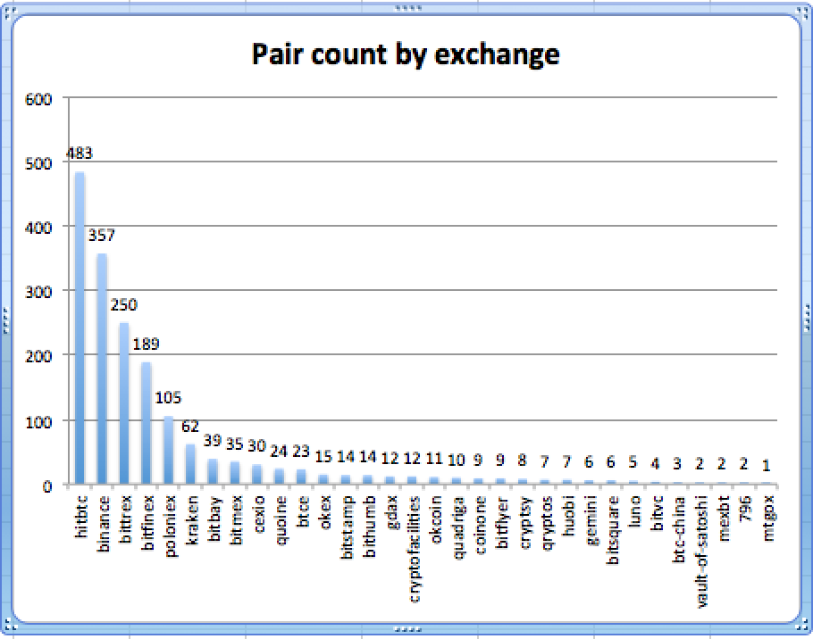
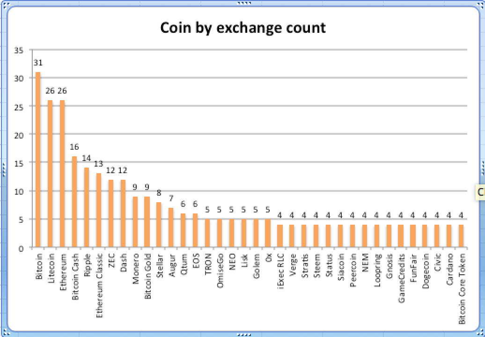

# cryptowatch-api-asset-parser

Application to download, parse and write the available assets displayed on the
cryptowatch endpoint: https://api.cryptowat.ch/assets into a json file.

# Installation and first run.
git clone project, package jar with maven and run with java. 

# Charts 

# TODO
- [ ] sort assets by highest number of markets
- [ ] group assets by exchange
- [ ] list asset with 2,3,4 and eq or gt 5 exchanges

