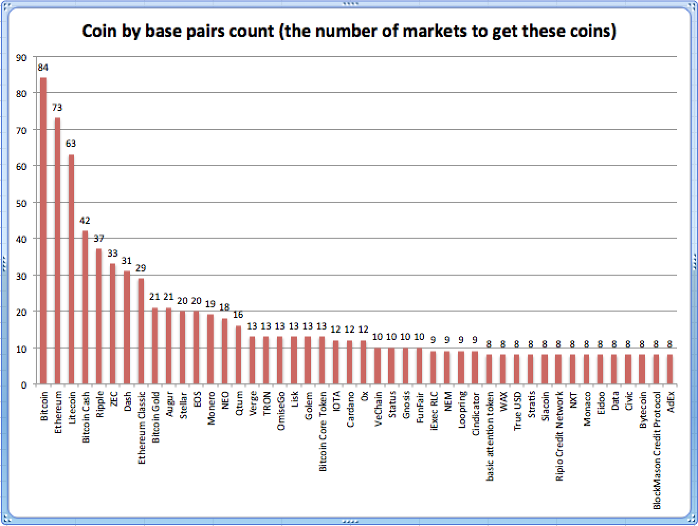

# cryptowatch-api-asset-parser

Application to download, parse and write the available assets displayed on the
cryptowatch endpoint: https://api.cryptowat.ch/assets into a json file.

# Installation and first run.
git clone project, package jar with maven and run with java. 

# Charts 
Chart #1: 
- This chart shows the number of markets by exchange. 
- If you are a serious trader and newbie to the crypto space hitbtc offers the highest number of market pairs. 
- Hitbtc is where you get the biggest crypto exposure.

Chart #2: 
- This chart shows how many exchanges (on 31) have this coin. 
- For example btc has been added on 31 exchanges. 
- Higher the number, the higher degree of liquidity. Btc is the conservative choice here.

Chart #3: 
- This chart shows the number of base pair markets for each coin. 
- Higher the number higher exchanges will offer a high number of different fiat or crypto markets to get the coin. 
- Higher the number, higher fiat market penetration, higher demand. 

# TODO
- [x] sort assets by highest number of markets
- [x] group assets by exchange (list asset with 2,3,4 and eq or gt 5 exchanges)
- [ ] create spring boot app to split use cases between: crawling, parsing, and generating the stats.

